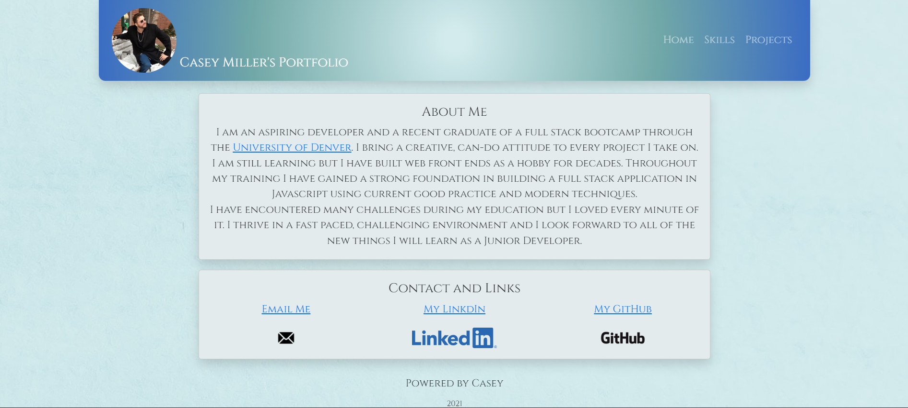

# React Portfolio

  ## Description
  
  This is my professional portfolio. It is designed using REACT.js. It is set up for future development of a full fledge backend with a database and inclusion of a web portal for me to add new projects and skills.
  
  ## License
  
  Developed under Mit License 
  
  ## Table of Contents
  
  - [Description](#description)
  - [Installation](#installation)
  - [Usage](#usage)
  - [Contributing](#contributing)
  - [License](#license)
  - [Test Instructions](#tests)
  
  ## Installation
  
  1. Clone the repo. 
  2. Run `npm i` in the root folder. 
  3. Run `npm run develop` to start the development server.
  
    
  ## Usage
  
  This is a professional portfolio designed to showcase my skills to potential employers.
  
  ## Screenshot
  
  
  
  ## Contributing
  
  I am not accepting contributions on this project.
  
  ## Tests
  
  Visit the link to the deployed app and test the funtionality.
  
  ---
  
  ## My GitHub
  
  [CaseySMiller](https://github.com/CaseySMiller)
  
  ## Email me
  
  [CaseySMiller@yahoo.com](mailto:CaseySMiller@yahoo.com)

